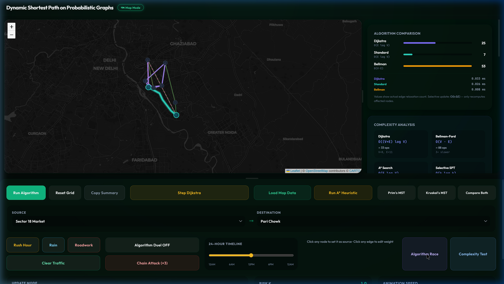
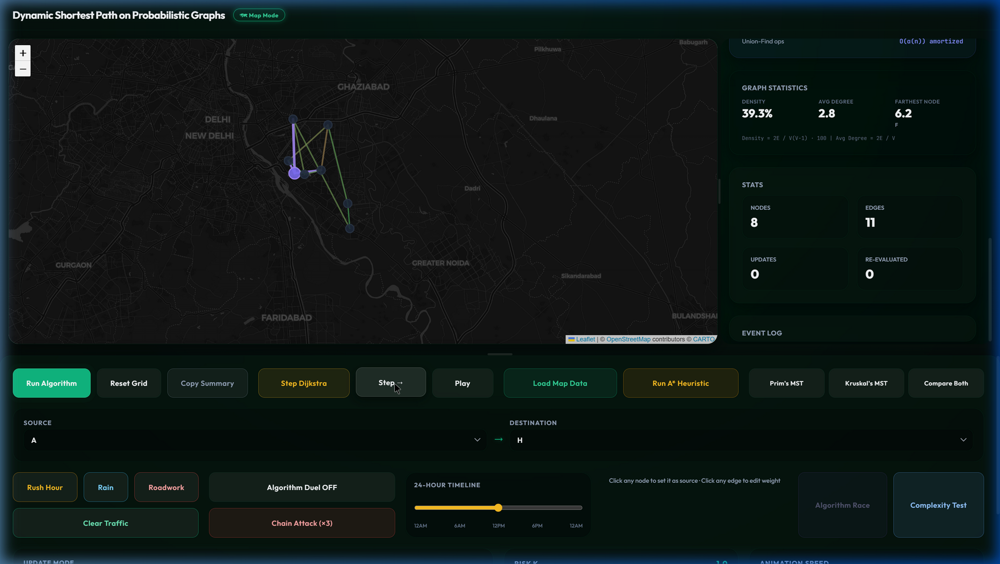
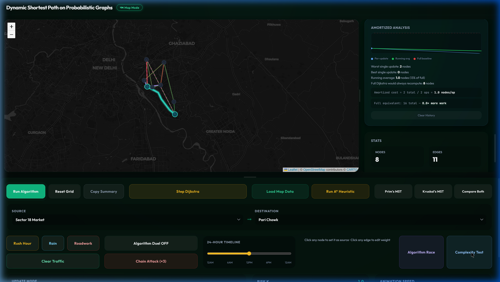

# Project Title: DAA PROJECT: DYNAMIC SHORTEST PATH ON PROBABILISTIC GRAPHS
**JAYPEE INSTITUTE OF INFORMATION TECHNOLOGY, NOIDA**  
**DEPARTMENT OF COMPUTER SCIENCE & ENGINEERING AND INFORMATION TECHNOLOGY**

 

**Enrol. No.** | **Name of Student**
--- | ---
2401030071 | Ivy Singh
2401030072 | Rashi Johari
2401030082 | Priyanshu Gumber
2401030376 | Ankita Parashar

 

**Course Name:** Design and Analysis of Algorithms  
**Program:** B. Tech. CSE  
**2nd Year 4th Semester**  
**2025-2026**  

---

 

## TABLE OF CONTENTS

| S. NO. | TOPIC |
| :---: | :--- |
| 1. | Problem Statement |
| 2. | Significance of Problem |
| 3. | Implementation Details |
| 4. | Output |
| 5. | References |

## 1. PROBLEM STATEMENT

Finding optimal paths in dynamic and probabilistic networks (such as real-world traffic systems) is a computationally intensive challenge. Traditional pathfinding algorithms like Dijkstra's or Bellman-Ford generally recompute the entire Shortest Path Tree (SPT) from scratch whenever edge weights change in a network. In large graphs, this is highly inefficient for minor, localized updates. Furthermore, there is a lack of advanced visualizers that allow students and engineers to empirically analyze algorithmic complexity, amortized costs, and internal algorithm state (like the priority queue heap) during execution.

The DAA Project is a full-stack, cinematic algorithm visualizer and high-performance computation engine designed to address this problem. It introduces a **"selective SPT update"** algorithm that dynamically recalculates only the affected nodes when edge weights fluctuate, bypassing full graph traversals. The platform also offers an interactive empirical complexity analysis, comparing algorithms like Dijkstra, Bellman-Ford, A* Heuristic, and Prim's/Kruskal's MST, visually demonstrating Big-O constraints in real-time on probabilistic real-world maps.

## 2. SIGNIFICANCE OF PROBLEM

Dynamic routing and probabilistic graphs are central to modern navigation and networking systems. The ability to model these mathematically and visualize their performance provides immense value:

- **Algorithmic Efficiency**: By avoiding full $O(E \log V)$ recomputations for minor graph updates, selective updates save massive computational resources. Selective updates achieve an amortized time of $O(k \log n)$, where $k$ represents only the localized affected nodes.
- **Pedagogical and Educational Value**: Standard black-box visualizers typically just show a final route, hiding the internal mechanics. By rendering live Min-Heap snapshots, per-edge relaxation logs, and amortized cost trackers, this project provides deep pedagogical insight into *how* the algorithms work step-by-step.
- **Real-World Probabilistic Modeling**: Real traffic edges possess both an expected weight (time) and variance (risk/sigma). The application models this by allowing users to tune risk parameters $k$, finding Pareto-optimal routes (balancing safe vs. fast) which traditional static Dijkstra ignores.
- **Asymptotic Validation**: The system dynamically validates theoretical bounds (like $O(n \log n)$) by running empirical scaling tests across randomized subgraphs, graphing actual wall-clock execution time against predicted mathematical curves.

## 3. IMPLEMENTATION DETAILS

### 3.1 Technology Stack

The application employs a highly performant, multi-language architecture to handle intensive graph computations and provide smooth visualizations:
- **Core Engine (Backend)**: Written in modern C++17. It implements custom MinHeaps, selective SPT propagation, Bellman-Ford negative cycle detection, Prim's and Kruskal's MST, and adversarial edge perturbation.
- **Middleware Server**: A Python Flask server that spawns the compiled C++ core engine as a subprocess. It bridges real-time WebSocket events via standard I/O (stdin/stdout) JSON communication and handles OpenStreetMap (OSM) spatial data loading.
- **Frontend Client**: Built with React 18, Vite, and D3-Force. It renders cinematic interactive networks, Leaflet-based real-world map overlays, and highly detailed inline SVG performance charts.

### 3.2 Dynamic Pathfinding and Selective Updates

When an edge weight fluctuates (simulating a traffic jam or clearance), a naive approach would execute Dijkstra again. Instead, our core engine intercepts the edge modification and, leveraging the pre-existing Shortest Path Tree (SPT), recursively propagates the distance delta:
- **If the weight increases**: It invalidates the affected subtree and reconnects severed nodes to the closest valid neighbors via a custom priority queue mechanism.
- **If the weight decreases**: It relaxes the modified edge and propagates the distance improvement downward through the SPT.

### 3.3 Empirical Complexity Engine

The system includes pure client-side graph generators that build networks of exponentially escalating sizes (N=8 to N=256). It measures exact wall-clock execution times for Dijkstra and Prim's algorithms and plots these empirical data points against a dynamically calculated $O(E \log V)$ theoretical curve, validating standard computational bounds through real hardware execution.

### 3.4 Advanced Visualization and Pedagogy

- **Algorithm Race**: Executes full Dijkstra and Selective SPT simultaneously on the backend, plotting real-time progress bars to prove the exact speedup factor and fraction of "Nodes Saved".
- **Heap Snapshots & Invariants**: During step-by-step execution, the frontend captures the `_data` array of the Min-Heap, displaying its contents and highlighting the extracted minimum. An invariant tracker segregates nodes into Settled, Frontier, and Undiscovered sets.
- **Relaxation Logs**: Every neighbor edge check is logged with arithmetic traces (e.g., `dist + weight = newDist`), indicating whether the relaxation successfully minimized the distance.
- **Amortized Cost Tracker**: An interactive SVG chart plots the number of nodes recomputed per dynamic edge update, calculating a running average to visually separate the amortized behavior from the flat cost of a full recompute.

## 4. OUTPUT

### 4.1 Algorithm Race & Empirical Complexity
Displays concurrent performance of Selective Updates vs Full Dijkstra, showing a measured 3x speedup on affected subtrees, alongside an overall empirical complexity analysis chart mapping $O(n \log n)$ bounds.

### 4.2 Step-by-step Dijkstra (Heap & Relaxation Log)
Showcases the priority queue Min-Heap snapshot at each extraction step, alongside a detailed per-edge relaxation log to mathematically justify path selections.

### 4.3 Amortized Cost Analysis & Map Overlay
Demonstrates the per-update recomputation cost over time on a real-world Leaflet map overlay, highlighting stable running averages and baseline comparisons.

## 5. REFERENCES

1. Thomas H. Cormen, Charles E. Leiserson, Ronald L. Rivest, and Clifford Stein. *Introduction to Algorithms*, Third Edition. MIT Press, 2009.
2. OpenStreetMap Data, OpenStreetMap Foundation. Retrieved from [https://www.openstreetmap.org](https://www.openstreetmap.org).
3. Ramalingam, G., & Reps, T. (1996). An incremental algorithm for a generalization of the shortest-path problem. *Journal of Algorithms*, 21(2), 267-305.
4. Leaflet - an open-source JavaScript library for mobile-friendly interactive maps. [https://leafletjs.com/](https://leafletjs.com/).
5. D3: Data-Driven Documents. [https://d3js.org/](https://d3js.org/).
